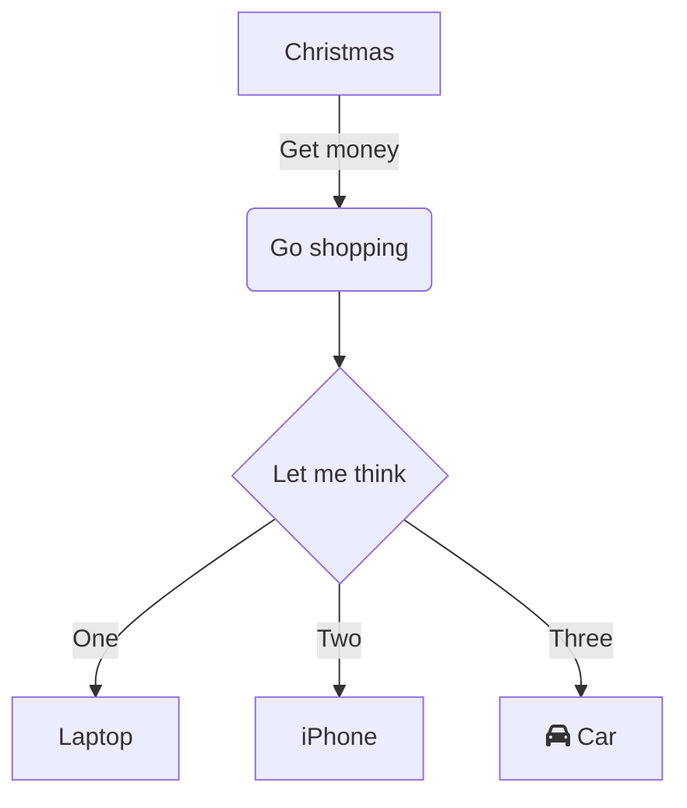

# Callouts
https://help.obsidian.md/Editing+and+formatting/Callouts
![[zone/_assets/callouts.png]]

> [!info]
> Here's a callout block.
> It supports **Markdown**, [[Internal link|Wikilinks]], and [[Embed files|embeds]]!

```
> [!info]
> Here's a callout block.
> It supports **Markdown**, [[Internal link|Wikilinks]], and [[Embed files|embeds]]!
```

## Custom Title

> [!tip] Callouts can have custom titles
> Like this one.

```markdown
> [!tip] Callouts can have custom titles
> Like this one.
```

## Foldable

> [!faq]- Are callouts foldable?
> Yes! In a foldable callout, the contents are hidden when the callout is collapsed.

```
> [!faq]- Are callouts foldable?
> Yes! In a foldable callout, the contents are hidden when the callout is collapsed.
```


# Mermaid
https://mermaid-js.github.io/mermaid-live-editor/


# Serializer

```
<!-- QueryToSerialize: QUERY HERE NO LINE BREAKS -->
```
